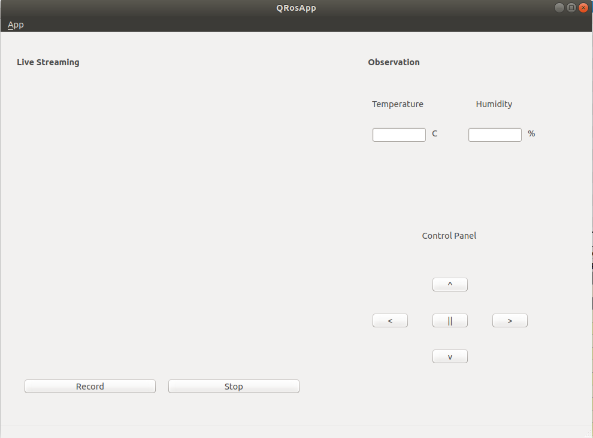
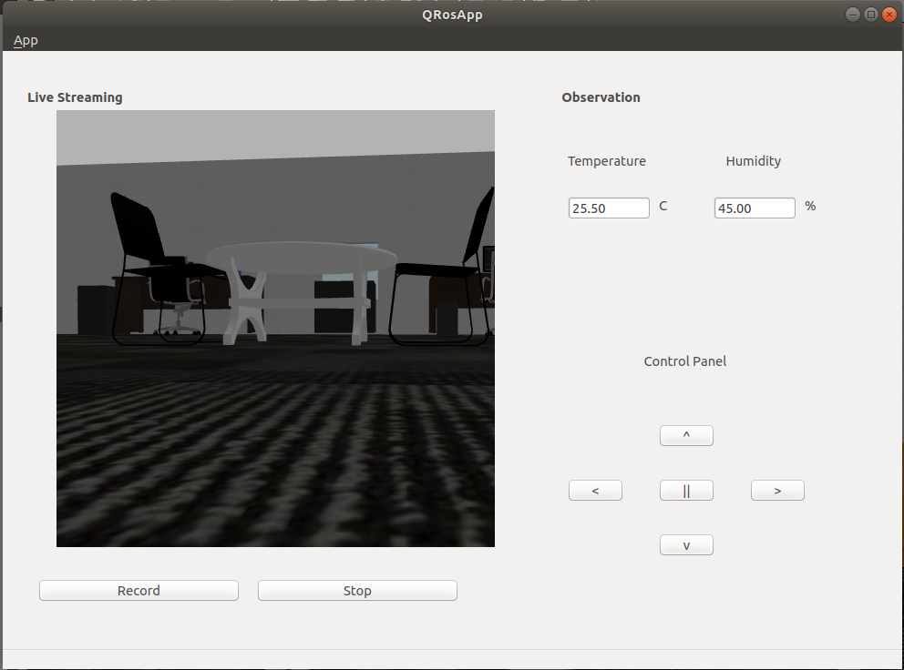
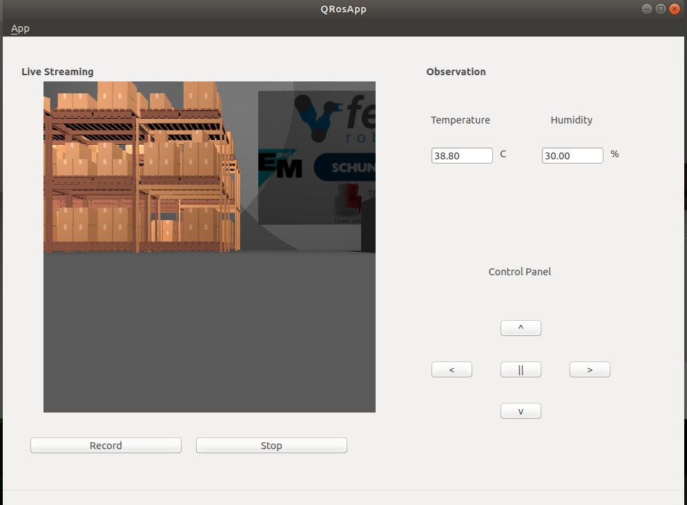

# Environmental Monitoring System

This project aims to monitor the surroundings and the environmental information like humidity and temperature by remote controlling the mobile robot. The project consists of three main parts, GUI development, Gazebo simulation environment implementation and system communication. The GUI is built using QT and the whole system communication is based on ROS. Here, to replicate the real-life scenario, different Gazebo simulation environments are used.

## Installation

### Build from source

Clone this package into your src folder of catkin_workspace:

cd <yr_catkin_ws>/src
git clone https://github.com/Ko-Sai/environmental_monitoring_system.git

Then compile with catkin:
```
catkin_make
```


## GUI




## Testing with Sample Environments

<p float="left">
  
   
  
</p>

## Usage

Run the following launch file to visualize the project. You can change the environments manually in the launch file.

```
source <YOUR_CATKIN_WORKSPACE_PATH>/devel/setup.bash
roslaunch master_node master_node.launch 
```

